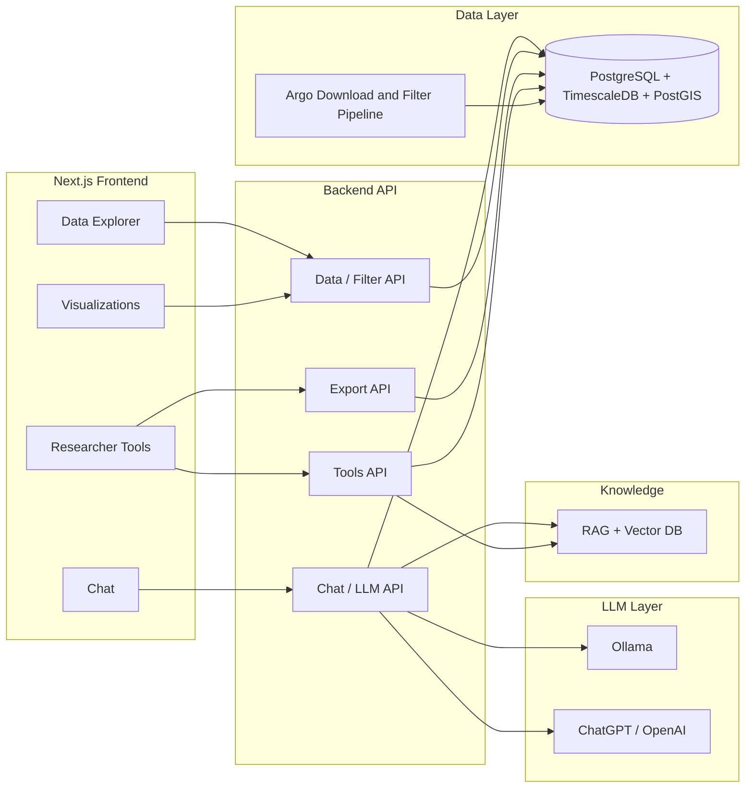

# Ocean Study Super Project – Detailed Plan

A detailed plan to evolve FloatChat Ultimate into a researcher-grade ocean study platform: multi-LLM (Ollama + ChatGPT), full Argo download and filtering pipeline, unified API, RAG over ocean knowledge, and researcher tools (export, visualizations, calculators, citations).

**Architecture overview:** See [`floatchat-architecture-system-design.png`](floatchat-architecture-system-design.png) for the full system diagram.

---

## 1. Current Project Summary

**What it is:** FloatChat Ultimate is an **AI-powered ocean data platform** in early MVP stage. It aims to make ARGO float data queryable via natural language.

**Existing structure:**

| Layer    | Technology                                  | Current state                                                                                                                                                                                                                   |
| -------- | ------------------------------------------- | ------------------------------------------------------------------------------------------------------------------------------------------------------------------------------------------------------------------------------- |
| Frontend | Next.js 15, Tailwind, Framer Motion         | Landing, Dashboard, Chat, Explorer, Visualizations pages; API client in `lib/api-client.ts`                                                                                                                                   |
| Backend  | FastAPI, PostgreSQL + TimescaleDB + PostGIS | `backend/main.py`: `/api/floats`, `/api/profiles`, `/api/stats`, `/api/chat`; DB schema in `backend/init-db.sql`                                                                                                                 |
| Data     | ARGO from IFREMER                           | `backend/data_ingestion/argo_ingestion.py`: index fetch, Indian Ocean filter, NetCDF parse, DB insert; limited to first 1000 index lines and 10 profiles per run                                                               |
| LLM      | Ollama only                                 | `backend/llm/ollama_engine.py`: NL→SQL + natural response; schema-aware prompts                                                                                                                                                 |
| Docs     | floatchat-docs                              | task.md, implementation_plan.md, project_structure.md, tech_stack_guide.md                                                                                                                                                        |

**Gaps vs your vision:**

- **Single LLM:** Only Ollama; no ChatGPT/OpenAI.
- **Argo scope:** No full "download + filter" pipeline (region, date, depth, QC, parameters); ingestion is sample-only.
- **No RAG:** No vector DB or document retrieval for "any answer" about ocean study beyond DB-backed SQL.
- **Researcher tools:** No export (CSV/NetCDF), no citation/reproducibility, no ocean calculators or reference info, no literature links.
- **API:** No formal filtering API for Argo (bbox, time range, depth, QC); minor issues (e.g. missing `logger` import in `main.py`, string interpolation in SQL in two places—should use parameters).

---

## 2. Target Vision: "Super Project" for Ocean Study

**Goal:** One platform that can answer **any** ocean-study-related question by combining:

- **Argo dataset:** Downloaded and filtered (region, time, depth, QC, parameters).
- **LLMs:** Ollama (local, private) + ChatGPT/OpenAI (optional, for richer answers).
- **Structured backend API:** All data and tools exposed via a single API.
- **Researcher tools:** Query builder, visualizations, export, citations, calculators, glossary, and (optionally) literature.
- **Cost principle:** The entire project—from development through production—must be **free of cost**, using only free tiers, free API keys, and open-source tools (see §3.11).

---

## 3. Architecture Breakdown

### 3.1 Backend API (single entry point)

- **Base URL:** e.g. `http://localhost:8000` (existing).
- **Planned route groups:**
  - **Data / Argo:** Filtered Argo (floats, profiles, measurements) by bbox, time range, depth range, QC flags, parameter list; pagination; optional aggregation.
  - **Chat:** Multi-provider chat (Ollama vs OpenAI) with context from DB + RAG; session/conversation support.
  - **Export:** Generate CSV/NetCDF/JSON for current filter or query result; include metadata for citation.
  - **Tools:** Ocean calculators (e.g. depth–pressure, salinity conversions), parameter glossary, and (if needed) small "reference facts" served from RAG or static content.

All of this can live in the existing FastAPI app (`backend/main.py`) with routers; no need for a separate "super API" server initially.

- **API versioning:** Use URL versioning (e.g. `/api/v1/...`) from day one; document deprecation policy when introducing v2 (e.g. 6-month overlap).

### 3.2 Argo data: download and filtering

**Download pipeline (evolve `argo_ingestion.py`):**

- **Index:** Use global index (e.g. `ar_index_global_prof.txt`) and optionally `ar_index_global_meta.txt` for float metadata.
- **Filter at index level:** Bounding box (lat/lon), date range, ocean basin, institution; produce list of NetCDF profile URLs/paths.
- **Download:** Configurable batch size and concurrency; retries; optional local cache (e.g. under `data/argo/` or `/tmp`).
- **Parse:** Keep/improve existing NetCDF parsing; support both per-profile files and monolithic `*_prof.nc`; map to existing DB schema (floats, profiles, measurements).
- **Quality:** Apply QC flags (e.g. only good/probably-good); optional depth/pressure and parameter filters before insert.
- **Load:** Upsert into PostgreSQL (floats, profiles, measurements) with conflict handling; optionally partition by time (already supported by TimescaleDB).

**Filtering API (new):**

- **Query params (or JSON body):** `bbox` (min_lon, min_lat, max_lon, max_lat), `start_date`, `end_date`, `min_depth`, `max_depth`, `qc_max` (e.g. 2), `parameters` (e.g. temperature, salinity), `wmo_numbers`, `limit`, `offset`.
- **Endpoints:** e.g. `GET /api/v1/argo/floats`, `GET /api/v1/argo/profiles`, `GET /api/v1/argo/measurements` (or a single "query" endpoint that returns profiles + measurements). All filtering in backend (no raw SQL from client); use parameterized queries only.

This gives researchers "Argo dataset by filtering" and a clear API contract.

### 3.3 Multi-LLM: Ollama + ChatGPT

- **Config:** Environment variables for OpenAI API key and model (e.g. `gpt-4o-mini` or `gpt-4`); Ollama base URL and model (existing).
- **Provider selection:** Per request or user preference (e.g. `provider: "ollama" | "openai"` in chat payload); default Ollama for privacy/cost.
- **Unified chat flow:**
  - Same input: user message + optional conversation history.
  - Step 1: Intent/classification (optional)—e.g. "data query" vs "general ocean question".
  - Step 2: For data queries: use existing NL→SQL (Ollama or OpenAI) + DB execution; for "any ocean question": optionally retrieve from RAG first, then generate answer with chosen LLM.
  - Step 3: Format response (text + optional table/chart payload) and optionally citation/references.
- **Implementation:** One "chat service" in backend that calls either existing Ollama engine or a new OpenAI client; shared schema context and prompt patterns.

### 3.4 RAG and "any answer" for ocean study

- **Purpose:** Support answers that go beyond the current DB (definitions, methods, formulas, best practices).
- **Components:**
  - **Vector DB:** e.g. Qdrant or Chroma (as in project_structure.md); run locally or in Docker.
  - **Corpus:** Curated documents (oceanography primers, Argo documentation, parameter definitions, formulae); optionally abstracts or key paragraphs from papers (if you add literature later).
  - **Ingestion:** Chunk text → embed (OpenAI or sentence-transformers) → store in vector DB with metadata (source, type).
  - **Retrieval:** On chat (or on "general" path), embed user question → top-k retrieval → pass as context to LLM (Ollama or ChatGPT).
- **Scope for MVP:** Small corpus (Argo manual, a few oceanography pages); no need for full literature integration in v1.

### 3.5 Researcher tools (all backed by API)

- **Data explorer:** Existing Explorer page enhanced with filter UI (map bbox, date range, depth, QC) that calls the new Argo filter API; table and simple charts (e.g. time series, T–S from selected profiles).
- **Visualizations:** Dedicated page(s) for maps (float/profiles), depth profiles (T, S), T–S diagrams, Hovmöller (if needed); data from same filter API.
- **Export:** Buttons "Download CSV" / "Download NetCDF" that call Export API with current filter or last query; backend generates file and returns link or stream; include "how to cite" (platform + date + filter).
- **Calculators / reference:** Small "tools" section: depth–pressure, salinity conversions, unit helpers; can be static or tiny API that uses same formulae as docs; glossary of parameters (from RAG or static JSON).
- **Citations:** Every export and (optionally) chat response can include a short "Suggested citation" (e.g. "FloatChat Ultimate, &lt;date&gt;, &lt;filter/query&gt;").

**More tools for ocean study (expand over time):**

- **Saved queries & workspaces:** Let users save filter presets and named queries; optional "workspace" or project to group saved views and exports for a study.
- **Compare mode:** Side-by-side or overlay comparison of two regions, time ranges, or floats (e.g. T–S from float A vs float B).
- **Notes & annotations:** Attach short notes or tags to a float, profile, or export for later reference; optional export of "method notes" with data.
- **Timeline / playback:** Time slider to step through profiles or animate float drift over time; useful for teaching and outreach.
- **Formula & method reference:** Dedicated "Reference" page: common ocean formulae (e.g. density, sound speed, depth–pressure), QC flag meanings, and links to Argo manual / standards.
- **Tutorials & onboarding:** In-app guided tours (e.g. "First query," "Export for a paper"); optional short video or step-by-step docs linked from the UI.
- **Quick stats panel:** One-click summary stats for current selection (min/max/mean T and S, profile count, date range) so researchers can sanity-check before export.
- **Literature & links:** Optional "Related resources" or "Learn more" links (Argo program, papers, ocean portals); can be curated list or RAG-driven suggestions later.

### 3.6 Security & authentication

- **Authentication:** JWT-based auth for web users; optional API keys for programmatic access (researchers, scripts). Session/conversation history scoped to authenticated user.
- **Authorization:** Role-based access (e.g. viewer, researcher, admin) if needed later; for MVP, authenticated vs anonymous (read-only) may suffice.
- **API security:** Rate limiting per IP and per user; parameterized queries only (no raw SQL from client); CORS and env-based secrets (no keys in repo).
- **Cost control (OpenAI):** Per-user or global spend limits; optional daily caps; fallback to Ollama when limit reached or key missing.

### 3.7 Reliability & operations

- **Argo pipeline:** Retries with backoff for downloads; idempotent upserts; optional local cache to avoid re-downloading. Log failures and alert on sustained errors.
- **LLM resilience:** If OpenAI is unavailable or rate-limited, fall back to Ollama; chat API returns clear error messages and optional "retry with local model."
- **Observability:** Structured logging (request IDs, user/session); health endpoints for DB, Redis, Ollama, Qdrant; optional metrics (Prometheus) and dashboards (Grafana) for API latency and pipeline runs.
- **Data retention:** Document policy for Argo data (e.g. "keep last N years" or "full history"); optional archival/export before purge. Export and citations should record "data as of" date for reproducibility.

### 3.8 Testing strategy

- **Unit:** NL→SQL logic, filter/query builders, calculator formulae, RAG retriever with mocked vector DB.
- **Integration:** API endpoints (data, chat, export) against test DB; Argo ingestion with sample NetCDF fixtures.
- **E2E:** Critical path: login (if auth) → apply filter → view data → export CSV → check citation text. Optional: chat → data question → verify response and SQL.
- **Target:** Maintain ≥70% coverage on backend; run tests in CI on every push.

### 3.9 Risks & mitigations

| Risk | Mitigation |
|------|------------|
| IFREMER/ARGO GDAC downtime or format change | Cache index and files locally; version and document NetCDF parsing; monitor GDAC status. |
| OpenAI API cost or rate limits | Default to Ollama; document spend limits; support local-only deployment. |
| SQL injection or unsafe LLM-generated SQL | Strict validation (SELECT only, allowlisted tables); parameterized execution; optional query review for sensitive envs. |
| Vector DB or RAG ingestion failures | Chat still works for data questions via NL→SQL; RAG optional; idempotent re-ingestion. |

### 3.10 UI/UX: Professional frontend

The frontend must feel **professional, polished, and production-grade** so researchers and students enjoy using the platform.

- **Visual design:**
  - **Colour:** Cohesive palette (e.g. ocean-inspired: deep blues, teals, clean neutrals); sufficient contrast for readability (WCAG AA where possible); consistent use of primary/secondary/feedback colours across all pages.
  - **Typography:** Clear hierarchy (headings, body, captions); readable font sizes and line height; monospace only where needed (e.g. SQL, code).
  - **Spacing & layout:** Consistent padding and margins; proper alignment and grid; no cramped buttons or overlapping elements; clear visual grouping of related controls.
- **Button & control placement:**
  - Primary actions (e.g. "Run query," "Export," "Send") are easy to find and consistently placed (e.g. bottom-right for send, top-right for export).
  - Secondary actions (filters, settings) are accessible but not dominant; destructive actions (e.g. clear) use secondary styling and optional confirmation.
  - Form fields have clear labels and sensible tab order; loading states disable only the relevant button and show a spinner or skeleton.
- **Animation & motion:**
  - **Superb but purposeful animation:** Use Framer Motion (or equivalent) for page transitions, list enter/exit, and micro-interactions (hover, focus, success).
  - Smooth transitions (e.g. 200–300 ms) for panel open/close, modal appear, and chart/data updates; avoid long or distracting motion.
  - Skeleton loaders for data-heavy views; subtle pulse or shimmer for "loading" so the UI feels responsive.
- **Consistency:** Reuse the same components (buttons, cards, inputs) and patterns across Dashboard, Chat, Explorer, and Visualizations; one design system (e.g. Tailwind + a small component library) for the whole app.
- **Responsiveness:** Layouts adapt to tablet and desktop; critical actions remain usable on smaller viewports; charts and maps scale or scroll appropriately.

### 3.11 Cost principle: free and open production

**Requirement:** The full lifecycle of the project—development, staging, and production—must remain **free of cost**. No paid APIs or paid infrastructure by default.

- **Stack choices (free/open):**
  - **LLM:** Prefer **Ollama** (local, free) as the default; OpenAI/ChatGPT only as an *optional* add-on when the user supplies their own API key (no platform spend).
  - **Database:** PostgreSQL + TimescaleDB + PostGIS (open-source); run on same host or free-tier DB (e.g. Neon, Supabase free tier, or self-hosted).
  - **Vector DB:** Qdrant or Chroma (open-source); run locally or in Docker—no paid vector service required.
  - **Embeddings (RAG):** Use open models (e.g. sentence-transformers, Ollama embeddings) so RAG works without OpenAI; optional OpenAI embeddings only if user provides key.
  - **Hosting:** Target free options: Vercel/Netlify free tier for frontend, Railway/Render/fly.io free tier or single VPS for backend; or full self-host (Docker Compose on a free-tier cloud VM or own machine).
- **API keys & paid services:**
  - **No mandatory paid API keys.** Any paid service (e.g. OpenAI) must be opt-in and user-provided (user’s key, user’s quota).
  - Document clearly: "For zero cost, use Ollama only; add your own OpenAI key if you want ChatGPT."
- **Data sources:** ARGO data from IFREMER GDAC is free; no paid data subscriptions required for core features.
- **Summary:** A researcher or institution can run and use the entire platform at **zero ongoing cost** by using only free tools, open-source software, and (when desired) their own API keys for optional paid features.

---

## 4. Implementation Phases (high level)

**Phase A – Foundation (API + Argo filter + security)**

- Fix backend: add `import logging; logger = ...` and replace string-interpolated SQL with parameterized queries in `main.py`.
- Add Argo filter API: new router with bbox, date, depth, QC, pagination; all DB access parameterized.
- Extend Argo ingestion: configurable region/date from index, batch download, full mapping to DB; document how to run "full Indian Ocean" or custom region.

**Phase B – Argo download and filtering E2E**

- Implement "download by filter" (index → file list → download → parse → load); optional scheduler or CLI for periodic updates.
- Frontend: Data Explorer uses new filter API (map + form); show profiles/measurements and basic charts (e.g. Recharts/Plotly for profiles).

**Phase C – Multi-LLM and RAG**

- Add OpenAI client and provider switch in chat; keep existing Ollama path.
- Introduce Qdrant (or similar) + ingestion script for ocean corpus; RAG retrieval in chat for non-SQL questions.
- Chat UI: optional "Use ChatGPT" toggle; show sources when answer is from RAG.

**Phase D – Researcher tools**

- Export API (CSV/NetCDF) with citation blob.
- Export and "Cite" in Explorer and Visualizations.
- Calculators + glossary (static or minimal API) and a "Tools" or "Reference" page.
- Additional study tools: saved queries, compare mode, notes/annotations, timeline/playback, formula reference, tutorials, quick stats panel (§3.5).

**Phase D+ – Professional UI/UX**

- Apply professional UI standards (§3.10): cohesive colour palette and typography, consistent spacing and layout.
- Proper button and control placement; primary/secondary actions clear; loading states and skeletons.
- Superb animation: page transitions, list/modal animations, micro-interactions (Framer Motion); keep motion purposeful and fast (200–300 ms).
- One design system across Dashboard, Chat, Explorer, Visualizations; responsive behaviour for tablet/desktop.

**Phase E – Polish and "super" level**

- Optional: BGC-Argo, satellite, or other datasets (separate ingestion + filter APIs).
- Documentation: API docs (OpenAPI), user guide for researchers, runbooks for Argo pipeline and RAG ingestion.
- Enforce cost principle (§3.11): document free-only deployment path; no mandatory paid APIs; optional OpenAI only with user’s key.

**Suggested duration (rough):** Phase A 2–3 weeks, Phase B 3–4 weeks, Phase C 3–4 weeks, Phase D 2–3 weeks, Phase D+ 2–3 weeks (UI/UX), Phase E ongoing. Total to "researcher-ready" MVP with professional UI: ~14–18 weeks.

---

## 5. Key Files and Changes

| Area                  | Files to add or change                                                                                                                                                       |
| --------------------- | ---------------------------------------------------------------------------------------------------------------------------------------------------------------------------- |
| API security & routes | `backend/main.py`: fix logger, parameterize queries; add `backend/routers/argo_filter.py`, `backend/routers/export.py`, `backend/routers/tools.py` (or under `api/v1/`)     |
| Argo pipeline         | `backend/data_ingestion/argo_ingestion.py`: index filter (bbox, date), batch download, full profile/measurement load; optional `config.yaml` or env for region/limits       |
| LLM                   | New `backend/llm/openai_engine.py`; extend `backend/llm/ollama_engine.py` or add `backend/llm/chat_service.py` that picks Ollama vs OpenAI                                   |
| RAG                   | New `backend/rag/` (retriever, embedder, ingestion script); Docker service for Qdrant; call from chat_service                                                               |
| Export                | `backend/routers/export.py` + service to build CSV/NetCDF from filter or saved query                                                                                         |
| Frontend              | Explorer: filter form + map → call filter API; Visualizations: charts from same API; new "Export" and "Cite" buttons; "Tools" page (calculators, glossary, §3.5 study tools). **UI/UX (§3.10):** design tokens (colours, spacing), Framer Motion, consistent buttons/layout, skeletons. |
| Config                | `.env.example`: `OPENAI_API_KEY` (optional, user-provided), `OLLAMA_BASE_URL`, `QDRANT_URL`, `ARGO_CACHE_DIR`, etc. All production paths free per §3.11.                                                                 |
| Auth & security       | `backend/routers/auth.py` (login, JWT); middleware for rate limit; optional `backend/core/api_keys.py` for programmatic access.                                                |

---

## 6. Success Criteria for "Super Project"

- **Any ocean-study question:** Data questions → NL→SQL + Argo DB; conceptual/method questions → RAG + LLM (Ollama or ChatGPT).
- **Argo dataset:** Download and filter by region, time, depth, QC via pipeline; same filters exposed in API and UI.
- **Backend by API:** All data and tools (data, chat, export, tools) available via a single API.
- **Researcher-ready:** Export (CSV/NetCDF), citation, basic visualizations, calculators/glossary, **plus more study tools** (saved queries, compare mode, notes, timeline, formula reference, tutorials, quick stats).
- **Professional UI:** Cohesive colours and typography, superb animation (Framer Motion), proper button placement and layout, responsive and consistent design (§3.10).
- **Free production:** Full deployment and usage possible at **zero cost** using only free tiers and open-source tools; paid APIs (e.g. OpenAI) only opt-in with user’s own key (§3.11).

This plan keeps your current stack (Next.js, FastAPI, PostgreSQL/TimescaleDB/PostGIS, Ollama), adds ChatGPT and RAG, and makes Argo "download + filtering" and researcher tools first-class. If you tell me your priority (e.g. "Argo filter API first" or "ChatGPT + RAG first"), the next step is to break that part into concrete tasks and file-level edits.

---

## 7. Plan review summary & suggestions

**What was already strong:** Clear current-state vs vision, phased implementation (A–E), architecture breakdown, key-files table, and success criteria. The plan is actionable and aligned with the "super project" goal.

**Additions made to this document:**

- **Architecture diagram reference** (top): Link to `floatchat-architecture-system-design.png` for the full system design.
- **Section 3.6 – Security & authentication:** JWT, API keys, rate limiting, and OpenAI cost control so the platform is safe and controllable.
- **Section 3.7 – Reliability & operations:** Retries for Argo pipeline, LLM fallback (OpenAI → Ollama), observability (logging, health, optional metrics), and data-retention/reproducibility.
- **Section 3.8 – Testing strategy:** Unit, integration, and E2E scope plus a coverage target so quality is part of the plan.
- **Section 3.9 – Risks & mitigations:** Table for GDAC dependency, OpenAI cost/limits, SQL safety, and RAG failures with concrete mitigations.
- **API versioning** (in 3.1): URL versioning and deprecation policy.
- **Suggested duration** (after Phase E): Rough 12–16 weeks to researcher-ready MVP.
- **Key files table:** Row for auth & security (routers, middleware, API keys).
- **§3.5 expanded – More tools for ocean study:** Saved queries & workspaces, compare mode, notes/annotations, timeline/playback, formula & method reference, tutorials & onboarding, quick stats panel, literature & links.
- **§3.10 – UI/UX: Professional frontend:** Visual design (colour, typography, spacing), button & control placement, superb animation (Framer Motion, 200–300 ms), consistency and responsiveness.
- **§3.11 – Cost principle: free and open production:** Entire project free of cost; Ollama/default free stack; OpenAI only opt-in with user’s key; free hosting and open-source only.
- **Phases:** Phase D+ (Professional UI/UX) and cost principle in Phase E; duration updated to ~14–18 weeks including UI polish.

**Further suggestions (optional):**

- **Accessibility:** Plan for basic a11y (keyboard nav, ARIA, contrast) in the Next.js UI so the tool is usable by all researchers.
- **i18n:** If the user base is multilingual, add "multi-language support" to Phase E and keep UI strings in a single place (e.g. JSON or i18n lib).
- **Deployment:** Document production deployment (e.g. Docker Compose prod profile, env-specific configs, DB migrations, backup/restore) in a separate runbook when moving beyond local/dev.

---

## 8. Implementation continuation update (2026-02-09)

### Completed now

- Enabled ARGO filter router in backend startup so `/api/v1/argo/*` endpoints are active from `main.py`.
- Kept chat provider API strict with validation for `auto`, `ollama`, and `gemini`.
- Hardened Ollama engine setup to use `OLLAMA_BASE_URL`, normalize `DATABASE_URL` format, and fail fast when Ollama is unreachable.
- Set chat UI default provider to `auto` so ARGO data questions prefer Ollama with Gemini fallback.
- Added frontend API client methods for ARGO filter and summary endpoints:
  - `filterArgoFloats`
  - `filterArgoProfiles`
  - `filterArgoMeasurements`
  - `getArgoSummaryStats`
- Connected Explorer UI to ARGO filtered APIs with region/date/depth/QC controls and measurement preview, using `/api/v1/argo/*/filter`.
- Added chat response transparency labels in UI for provider source and query classification (`source`, `query_type`).
- Added backend smoke test script `backend/test_smoke_api.py` for `/health`, `/api/chat/providers`, `/api/v1/argo/stats/summary`, and `/api/v1/tools/learn/insights`.
- Added new backend Tools API router (`/api/v1/tools/*`) with:
  - glossary endpoint
  - depth-pressure calculator endpoint
  - learning insights endpoint generated from ARGO DB
  - quick stats endpoint
- Added new backend Export API router (`/api/v1/export/*`) with:
  - floats CSV export
  - profiles CSV export
  - measurements CSV export
  - combined JSON snapshot export with citation metadata
- Added frontend `Research Tools` page (`/tools`) connected to backend tools APIs (live insights, calculator, glossary search, learning prompts).
- Reworked Visualizations page to use backend ARGO filters and measurements (removed static sample-only dependency).
- Reworked Dashboard to use backend-first data (`/api/v1/argo/stats/summary`, filtered floats, `/api/chat/providers`).
- Applied UI system refinement (new typography, unified cyan/blue ocean palette, upgraded global styling and glass surfaces).
- Added one-click export actions in Explorer and Visualizations (CSV + JSON snapshot) tied to current filter state.
- Updated backend startup script (`start-backend.ps1`) to auto-wire local PostgreSQL + Ollama defaults and check Ollama availability.
- Improved provider health responsiveness by making Ollama availability checks fast-fail (short timeout) to avoid provider endpoint delays.
- Verified end-to-end smoke checks pass against local backend (health, providers, ARGO stats, tools insights, export CSV).
- Added NetCDF export endpoint for measurements and frontend NetCDF export actions in Explorer/Visualizations.
- Upgraded ARGO ingestion pipeline from sample-only to configurable CLI mode (region/bbox/date/index-limit/max-profiles/cache/timeout).
- Added guided onboarding + quick presets + saved presets in Explorer.
- Added compare mode and study notes (local workspace annotations) in Tools.
- Phase B status: **completed for current scope** (backend filter APIs + frontend E2E + ingestion CLI upgrade).
- Phase D status: **completed for current scope** (exports incl. NetCDF, tools page, glossary/calculators/insights, compare, notes).

### Why this matters for Ollama + ARGO combination

- ARGO dataset filtering is now available as first-class backend API routes.
- Ollama integration is now configuration-driven and easier to operate across local or container setups.
- Chat flow can stay in one interface while choosing provider strategy (`auto` for hybrid behavior).

### Immediate next steps

1. Phase C completion: add RAG retrieval + optional OpenAI provider path and source-cited answers.
2. Phase E completion: production docs/runbooks, deployment profiles, and automated CI integration tests.
3. Expand exports to profile-level NetCDF and citation templates per journal style if needed.
4. Add authentication for saved presets/notes/workspaces (currently browser-local storage).

## 9. Implementation continuation update (2026-02-10)

### Phase C completion (current scope)

- Added optional OpenAI provider path in backend chat orchestration (`openai` provider alongside existing providers).
- Added RAG module with:
  - retriever runtime (`backend/rag/retriever.py`)
  - default corpus fallback (`backend/rag/default_corpus.py`)
  - ingestion CLI for Qdrant vector indexing (`backend/rag/ingest_corpus.py`)
  - starter corpus files (`backend/rag/corpus/*`)
- Wired general-question flow to retrieve context and return source metadata (`sources`) in `/api/chat` responses.
- Updated frontend chat UI to select `openai` and render source citations from API responses.

### Phase E completion (current scope)

- Added backend integration/unit tests under `backend/tests/`:
  - API integration tests
  - chat service routing/fallback tests
  - RAG lexical fallback tests
- Added CI workflow at `.github/workflows/ci.yml`:
  - frontend type/lint checks
  - backend test execution
- Added production/operations docs:
  - `docs/runbooks/production-deployment.md`
  - `docs/runbooks/rag-ingestion.md`
  - `docs/runbooks/validation-and-ci.md`
- Updated environment/deployment configs for RAG defaults (`QDRANT_URL`, `QDRANT_COLLECTION`, `RAG_ENABLED`) and added Qdrant service in Docker Compose.

### Phase D+ continuation (UI/UX polish in this cycle)

- Fixed frontend TypeScript blockers:
  - resolved stale `.next` type inclusion issues via `tsconfig.json` cleanup
  - fixed `Map` symbol shadowing in `app/visualizations/page.tsx`
- Applied visual system polish across Chat, Dashboard, Explorer, and Visualizations:
  - added layered sea-grid atmospheric backgrounds
  - added higher-quality ocean card surfaces (`ocean-card`) and pill styles
  - improved provider controls and chat source presentation styling
  - removed leftover purple accent in Explorer to keep consistent ocean palette

## 10. Implementation continuation update (2026-02-10, final pass)

### Completed in this pass

- Finalized Phase A security gap in local mode:
  - parameterized SQLite queries in `backend/main_local.py` for `/api/floats` and `/api/profiles`.
- Extended Phase D researcher workflow completeness:
  - workspace-backed saved query presets and compare/timeline history surfaced in `app/tools/page.tsx`.
- Completed Phase E optional dataset coverage:
  - BGC-Argo ingestion script added (`backend/data_ingestion/bgc_argo_ingestion.py`).
  - BGC API router (`/api/v1/bgc/*`) wired with filter, summary, and guarded clear endpoints.
- Completed auth/workspace persistence implementation:
  - JWT security helpers in `backend/core/security.py`.
  - auth router (`/api/v1/auth/*`) with register/login/me.
  - study router (`/api/v1/study/*`) for workspaces, notes, saved queries, compare history, timeline history.
- Expanded integration test coverage for new routes:
  - auth + workspace + notes + saved queries + compare + timeline flow.
  - BGC summary/filter/clear flow.

### Validation snapshot

- `pnpm -C floatchat-ultimate exec tsc --noEmit` passed.
- `pnpm -C floatchat-ultimate exec eslint app/chat/page.tsx app/explorer/page.tsx app/visualizations/page.tsx app/dashboard/page.tsx app/tools/page.tsx app/page.tsx app/layout.tsx lib/api-client.ts components/map/FloatMap.tsx --max-warnings 0` passed.
- `python -m pytest -q floatchat-ultimate/backend/tests -p no:cacheprovider` passed (`10` tests).

### Phase status summary (current scope)

- Phase A: completed.
- Phase B: completed.
- Phase C: completed.
- Phase D and D+: completed.
- Phase E (current defined scope): completed.
